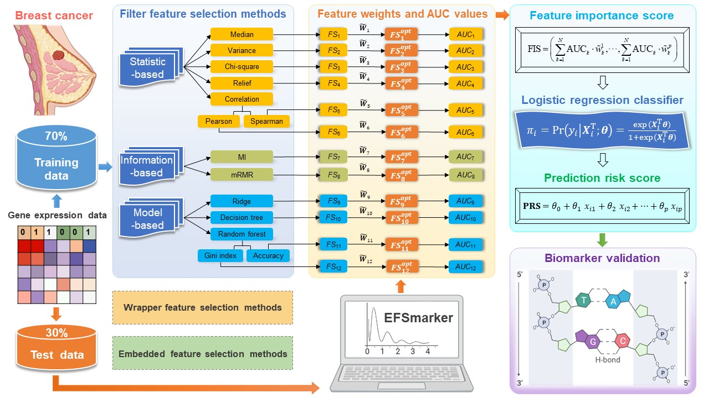

# [EFSmarker: Identifying diagnostic biomarkers of breast cancer based on gene expression data and ensemble feature selection](https://github.com/zpliulab/EFSmarker)

In this work, we provide **propose an ensemble feature selection method for biomarker discovery** (abbreviated as **EFSmarker**) based on multiple different independent feature elections methods to give a better approximation to the optimal subset of features. Actually, the proposed method of discovering biomarkers for **breast cancer (BRCA)** can be easily extended to other complex diseases.

## EFSmarker
<!--START_SECTION:news-->
* **EFSmarker**: A method of ensemble feature selection method for identifying diagnostic biomarkers from gene expression data. 
* If you have any questions about **EFSmarker**, please directly contact the corresponding author [Prof. Zhi-Ping Liu](https://scholar.google.com/citations?user=zkBXb_kAAAAJ&hl=zh-CN&oi=ao) with the E-mail: zpliu@sdu.edu.cn
<!--END_SECTION:news-->

## Citation
Li, Lingyu, et al. "**Identifying Diagnostic Biomarkers of Breast Cancer Based on Gene Expression Data and Ensemble Feature Selection Methods**." [Current Bioinformatics](https://benthamscience.com/journal/cbio), 2023, 18(3): 232-246. [EFSmarker paper website](https://www.eurekaselect.com/article/128764)

## Data
<!--START_SECTION:news-->
* In the **Data** and **DataPython** files, we only give some necessary files for each R or Python program. 
* Some of these input files only give the first few lines, but this does not affect the results of the work (**EFSmarker**).
* Files **Results**, it contains some results obtained from twelve filter feature selection methods and some pictures obtained from online tools.
<!--END_SECTION:news-->

## R code for EFSmarker
The **serial number (1) (2) ... (10)** represents the order in which the program runs in our work.
<!--START_SECTION:news-->
* (1) TCGA_pro_clin_DE.R  --  First process the data to get the data of all samples. Then select 112 Tumor + 112 Normal samples to get DEGs.
* (2) malacards_mamaprint_KEGG_TF.R  --  Integrate data from MalaCards, Mamaprint, KEGG, TF in RegNetwork, DEGs to union gene and corresponding expression data.
* (3) data_splitR.R/data_splitPython.R  --  According to the random seeds of other methods, the scaled data of the union gene of TCGA is divided into training data and testing data.
* (4) EFS.py  --  Perform filter feature selection using Chi-square, MI, Decision tree, Relief using Python.
* (5) dataPython.R  --  Reprocess the results from python and put the processed data into R.
* (6) EFS.R  --  Perform filter feature selection using Median, Variance, Correlation, Ridge regression, Random forest and mRMR. Then apply the logistic regression classifier to obtain the AUC values of all feature subsets. Finally, establish a feature importance score (FIS) index to select the features with higher FIS as the identified biomarkers.
* (7) feature_select_TCGA.R  --  Extract the expression value of the biomarkers from the discovery dataset. Then make cluster analysis and differential expression analysis.
* (8) Functional enrichment analysis using Metascape online database, the results can be found in the file Metascape.
* (9) feature_select_all_new.R  --  Extract the expression value of the biomarkers from ten external independent validation datasets from the GEO database. Then use the logistic regression model to validate the prediction performance. At the same time, the PRS index is calculated.
* (10) ROCplot.R  --  Plot ROC curves on independent datasets.
<!--END_SECTION:news-->

## Ensemble Feature Selection Method for Biomarker Discovery
<!--START_SECTION:news-->
* [Feature selection is one of the most fundamental problems in data analysis, machine learning, and data mining](https://doi.org/10.1007/978-3-030-64583-0_19). Especially in domains where the chosen features are subject to further experimental research, the stability of the feature selection is very important. 
* For data sets with similar features, the evaluation of feature selection stability is more difficult. An example of such data sets is gene expression data sets, where genes of the same biological processes are often highly positively correlated.  
<!--END_SECTION:news-->

## StabML-RFE (2022), Zhi-Ping Liu all rights reserved
This program package is supported by the copyright owners and coders "as is" and without warranty of any kind, express or implied, including, but not limited to, the implied warranties of merchantability and fitness for a particular purpose. In no event shall the copyright owner or contributor be liable for any direct, indirect, incidental, special, exemplary, or consequential damages (including, without limitation, procurement of substitute goods or services; loss of use, data, or profits; or business interruption), regardless of the theory of liability, whether in contract, strict liability or tort (including negligence or otherwise) for any use of the software, even if advised of the possibility of such damages.

     
